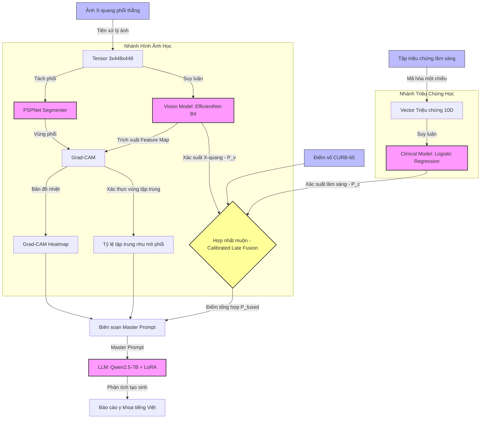

# 🏥 Pneumonia-AI (Multimodal Diagnostic AI Service)

[](https://fastapi.tiangolo.com/)
[](https://streamlit.io/)
[](https://pytorch.org/)
[](https://huggingface.co/)
[](https://www.docker.com/)

*Đọc bằng ngôn ngữ khác: [🇻🇳 Tiếng Việt](#-tiếng-việt) | [🇬🇧 English](#-english)*

---

## 🇻🇳 Tiếng Việt

Phân hệ **AI Microservice** cốt lõi của Hệ thống Hỗ trợ Quyết định Lâm sàng (CDSS) Chẩn đoán Viêm phổi. Dịch vụ này sử dụng kiến trúc **học máy đa phương thức (Multimodal Fusion)**, tích hợp thế mạnh của thị giác máy tính chuyên sâu (Computer Vision), mô hình học máy lâm sàng (Tabular ML) và trí tuệ nhân tạo tạo sinh (GenAI LLM) để tối ưu hóa tính chính xác và độ giải thích y học của quyết định lâm sàng.

### 📐 1. Kiến Trúc Mô Hình AI Đa Phương Thức

Hệ thống tích hợp 4 thành phần AI chuyên biệt để tạo thành quy trình chẩn đoán khép kín:



#### A. Nhánh Hình ảnh học (Vision AI - EfficientNet-B4)
- **Nhiệm vụ:** Nhận diện và định vị tổn thương nhu mô phổi (đông đặc phế nang, bóng mờ, thâm nhiễm).
- **Cơ chế:** Phân loại nhị phân trên ảnh X-quang phổi thẳng (được chuẩn hóa 448x448). Hỗ trợ tăng cường lúc suy luận (Test-Time Augmentation - TTA bằng cách lật ngang ảnh) để giảm nhiễu chẩn đoán.

#### B. Nhánh Định vị & Phân đoạn Phổi (Segmentation AI - PSPNet)
- **Nhiệm vụ:** Phân đoạn vùng phổi trái và phải sử dụng thư viện `torchxrayvision` (PSPNet).
- **Mục đích:** Xác định chính xác vùng giải phẫu của phổi, làm ranh giới đối chiếu để tính toán **Tỷ lệ tập trung nhu mô phổi (lung_focus_ratio)** của thuật toán **Grad-CAM**, đảm bảo AI tập trung phân tích đúng khu vực phổi thay vì các vùng nhiễu (như xương sườn hay phần mềm ngoài lồng ngực).

#### C. Nhánh Triệu chứng học (Clinical AI - Logistic Regression)
- **Nhiệm vụ:** Tính xác suất rủi ro dựa trên tập 10 triệu chứng cơ năng chuẩn hóa: *Ho, Sốt cao, Khó thở, Nhịp tim nhanh, Đờm màu rỉ sắt, Mệt mỏi, Ớn lạnh, Đau ngực, Khạc đờm, Uể oải*.
- **Cơ chế:** Mã hóa vector nhị phân 10 chiều đầu vào và suy luận bằng thuật toán Logistic Regression.

#### D. Thuật toán Hợp nhất Hiệu chuẩn (Calibrated Late Fusion)
Kết quả từ 2 nhánh không cộng trung bình đơn giản mà được hiệu chuẩn qua hàm log-odds:
1. Chuyển xác suất Vision (P<sub>v</sub>) và Clinical (P<sub>c</sub>) thành thang log-odds (z<sub>img</sub>, z<sub>sym</sub>).
2. Tính toán độ chênh lâm sàng so với trạng thái không triệu chứng (nudge = w<sub>sym</sub> × (z<sub>sym</sub> - logit<sub>base</sub>)). Nudge này được giới hạn chỉ điều chỉnh *tăng lên* (nudge up) để tránh phủ nhận tổn thương thực thể trên phim X-quang.
3. Điểm số **CURB-65** được giữ lại cho cảnh báo và phân cấp rủi ro lâm sàng thay vì cộng vào log-odds chẩn đoán.
4. Hợp nhất: z<sub>fused</sub> = z<sub>img</sub> + nudge và đưa qua hàm Sigmoid để sinh ra điểm số tổng hợp P<sub>fused</sub>.
5. **Cơ chế phân cấp rủi ro & ghi đè khẩn cấp (Emergency Override):** Nếu điểm CURB-65 $\ge 3$ (ca nguy cấp), hệ thống tự động cưỡng chế phân loại rủi ro thành **HIGH** bất kể P<sub>fused</sub> để đảm bảo an toàn tối đa cho bệnh nhân. Ngược lại, mức rủi ro được xếp dựa trên P<sub>fused</sub> (HIGH $\ge 0.70$, MEDIUM $\ge 0.35$, LOW $< 0.35$).

#### E. Biên luận Lâm sàng Tạo sinh (GenAI LLM - Qwen2.5-7B + LoRA)
- **Nhiệm vụ:** Tinh chỉnh (LoRA fine-tuning) mô hình **Qwen2.5-7B-Instruct** để đóng vai trò Hội đồng Y khoa ảo, tự động biên dịch kết quả định lượng thành báo cáo chẩn đoán y khoa chuyên nghiệp và hướng dẫn xử trí lâm sàng bằng tiếng Việt.
- **Tính năng Dự phòng (Simulation Fallback Mode):** Nếu chạy trên thiết bị không có GPU/CUDA, hệ thống tự động kích hoạt bộ sinh báo cáo y khoa dựa trên luật chuyên gia để duy trì dịch vụ hoạt động ổn định 100%.

### 📂 Cấu Trúc Dự Án

```text
├── app/                     # Backend FastAPI
│   ├── api/                 # Các API Endpoint (v1) định nghĩa định tuyến
│   ├── core/                # Quản lý cấu hình, biến môi trường (Settings)
│   ├── dependencies/        # Singleton ModelLoader (quản lý nạp model, GPU/CPU warm-up)
│   ├── exceptions/          # Các ngoại lệ tùy chỉnh của phân hệ AI
│   ├── main.py              # File chạy chính của FastAPI
│   ├── schemas/             # Định nghĩa cấu trúc dữ liệu Pydantic (Request/Response)
│   ├── services/            # Logic nghiệp vụ cốt lõi (Inference, LLM)
│   └── utils/               # Tiền xử lý ảnh, Grad-CAM, sinh prompt, tính toán chỉ số
├── notebooks/               # Thư mục chứa code nghiên cứu & huấn luyện mô hình (Jupyter Notebooks)
│   ├── finalversiontrainimagexray.ipynb  # Huấn luyện Vision (EfficientNet-B4)
│   ├── pneumoniaclinic.ipynb             # Huấn luyện Clinical (Logistic Regression)
│   └── aillmpneumonia.ipynb              # Tinh chỉnh LLM LoRA (Qwen2.5-7B)
├── scripts/                 # Kịch bản bổ trợ (ví dụ: huấn luyện, vẽ đồ thị)
├── streamlit_app.py         # Ứng dụng demo Streamlit tương tác nhanh
├── requirements.txt         # Danh sách thư viện Python phụ thuộc
├── Dockerfile               # Cấu hình đóng gói Docker container
└── .env.example             # Mẫu khai báo biến môi trường
```

### 💻 Hướng Dẫn Cài Đặt

**1. Clone dự án và cấu hình:**
```bash
git clone https://github.com/Tienkun2/Pneumonia-AI.git
cd Pneumonia-AI
python -m venv venv
# Kích hoạt môi trường ảo:
# Windows: venv\Scripts\activate
# Linux/Mac: source venv/bin/activate
pip install -r requirements.txt
cp .env.example .env
```

**2. Tải và thiết lập trọng số mô hình:**
Đảm bảo bạn đã đặt các file trọng số mô hình vào đúng thư mục cấu hình:
- Trọng số Vision: `.pth` của EfficientNet-B4.
- Trọng số Clinical: `.joblib` của Logistic Regression và danh sách triệu chứng.
- Trọng số LLM: Thư mục chứa base model Qwen và adapter LoRA.

**3. Khởi chạy FastAPI Service:**
```bash
uvicorn app.main:app --host 0.0.0.0 --port 8000 --reload
```
Truy cập tài liệu API tự động tại: [http://localhost:8000/docs](http://localhost:8000/docs) hoặc [http://localhost:8000/redoc](http://localhost:8000/redoc)

**4. Khởi chạy Giao diện Demo (Streamlit):**
```bash
streamlit run streamlit_app.py
```
Giao diện sẽ chạy tại địa chỉ: [http://localhost:8501](http://localhost:8501)

**5. Chạy bằng Docker:**
```bash
docker build -t pneumonia-ai:latest .
docker run -p 8000:8000 --env-file .env pneumonia-ai:latest
```

### 📡 Các API Endpoint Chính

- **POST** `/api/v1/predict`: Nhận file ảnh X-quang, chuỗi triệu chứng lâm sàng và điểm CURB-65 để trả về kết quả dự báo tổng hợp, bản đồ nhiệt Grad-CAM dạng base64, và Master Prompt.
- **POST** `/api/v1/diagnose`: Nhận thông tin chẩn đoán, thực hiện phân tích đầy đủ và đồng thời kích hoạt LLM để tạo báo cáo y khoa chi tiết dạng văn bản.
- **POST** `/api/v1/chat`: Cổng kết nối chatbot y tế, nhận lịch sử hội thoại và trả về phản hồi y khoa từ LLM.
- **GET** `/api/v1/health`: Kiểm tra trạng thái sẵn sàng của dịch vụ và trạng thái tải mô hình AI.

---

## 🇬🇧 English

The core **AI Microservice** of the **Pneumonia Diagnosis Clinical Decision Support System (CDSS)**. This service operates on a **Multimodal Fusion** architecture, blending computer vision, clinical tabular ML, and generative artificial intelligence (GenAI) to maximize the accuracy and explainability of clinical diagnostic decisions.

### 📐 1. Multimodal AI Model Architecture

The system coordinates 4 specialized AI components to execute a unified diagnostic workflow:

- **Vision AI Branch (EfficientNet-B4)**: Classifies chest X-ray scans (normalized to 448x448) for parenchymal lesions (alveolar consolidation, infiltration). Implements Test-Time Augmentation (TTA via horizontal flips) to minimize diagnostic variance.
- **Segmentation AI Branch (PSPNet)**: Segments left and right lung contours utilizing the `torchxrayvision` package. Used as a structural boundary to compute the **lung_focus_ratio** of the **Grad-CAM** thermal maps, filtering out external artifacts (such as ribs, skin, and electrodes).
- **Clinical AI Branch (Logistic Regression)**: Computes a baseline clinical risk probability ($P_c$) from a 10-dimensional binary symptom vector (symptoms include: *Cough, High fever, Breathlessness, Fast heart rate, Rusty sputum, Fatigue, Chills, Chest pain, Phlegm, Lethargy*).
- **Calibrated Late Fusion Algorithm**: Combines Vision (P<sub>v</sub>) and Clinical (P<sub>c</sub>) predictions using a log-odds transfer:
  1. Converts probabilities into log-odds space (z<sub>img</sub>, z<sub>sym</sub>).
  2. Applies a clinical symptom nudge (nudge = w<sub>sym</sub> × (z<sub>sym</sub> - logit<sub>base</sub>)). This nudge is capped to only adjust *upwards* (nudge up), preserving the physical evidence of chest scans.
  3. Retains the **CURB-65** score as a clinical severity indicator for warnings and risk categorization, rather than adding it to the diagnostic probability.
  4. Fuses them: z<sub>fused</sub> = z<sub>img</sub> + nudge and decodes through Sigmoid to output P<sub>fused</sub>.
  5. **Risk Categorization & Emergency Override:** If CURB-65 $\ge 3$ (severe case), the system immediately overrides and forces the risk level to **HIGH** regardless of P<sub>fused</sub>. Otherwise, risk is categorized based on P<sub>fused</sub> (HIGH $\ge 0.70$, MEDIUM $\ge 0.35$, LOW $< 0.35$).
- **Generative AI Clinical Reporter (Qwen2.5-7B + LoRA)**: A fine-tuned **Qwen2.5-7B-Instruct** model adapted via LoRA. It analyzes the synthesized case prompt to output a structured clinical consultation report and treatment recommendations in medical-grade Vietnamese.
  - **Simulation Fallback Mode**: Automatically active on CPU-only hosts or when CUDA is unavailable. It activates a rule-based expert diagnostic writer to guarantee 100% service uptime.

### 📂 Directory Structure

```text
├── app/                     # FastAPI Application Package
│   ├── api/                 # API Route controllers and endpoint definitions (v1)
│   ├── core/                # System settings and environment configuration
│   ├── dependencies/        # ModelLoader singleton (lazy loading, warmups, GPU check)
│   ├── exceptions/          # Custom AI application exception handlers
│   ├── main.py              # Application startup file
│   ├── schemas/             # Pydantic schemas (Request and Response validations)
│   ├── services/            # Core logical services (InferenceService, LLMService)
│   └── utils/               # Image/clinical preprocessing, Grad-CAM, prompts, metrics
├── notebooks/               # Jupyter Notebooks for model research and training
│   ├── finalversiontrainimagexray.ipynb  # Vision model training (EfficientNet-B4)
│   ├── pneumoniaclinic.ipynb             # Clinical model training (Logistic Regression)
│   └── aillmpneumonia.ipynb              # LLM Fine-tuning LoRA (Qwen2.5-7B)
├── scripts/                 # Utility scripts (training models, metric plotting)
├── streamlit_app.py         # Streamlit UI prototype app
├── requirements.txt         # Python library dependencies
├── Dockerfile               # Deployment container configuration
└── .env.example             # Environmental variable templates
```

### 💻 Installation & Setup

**1. Setup Environment:**
```bash
git clone https://github.com/Tienkun2/Pneumonia-AI.git
cd Pneumonia-AI
python -m venv venv
# Activate virtual environment:
# Windows: venv\Scripts\activate
# Linux/Mac: source venv/bin/activate
pip install -r requirements.txt
cp .env.example .env
```

**2. Download Weights:**
Deploy your model binary files to their configured locations:
- Vision weight: `.pth` file for EfficientNet-B4.
- Clinical weight: `.joblib` files.
- LLM weight: Qwen base directory and LoRA adapter weights folder.

**3. Run FastAPI Application:**
```bash
uvicorn app.main:app --host 0.0.0.0 --port 8000 --reload
```
Access the interactive documentation panel at: [http://localhost:8000/docs](http://localhost:8000/docs)

**4. Run Streamlit Quick Demo:**
```bash
streamlit run streamlit_app.py
```
Open [http://localhost:8501](http://localhost:8501) on your local browser.

**5. Docker Compilation:**
```bash
docker build -t pneumonia-ai:latest .
docker run -p 8000:8000 --env-file .env pneumonia-ai:latest
```

### 📡 Main API Endpoints

- **POST** `/api/v1/predict`: Parses a chest scan, clinical symptoms, and CURB-65 score to compute predictions, generating a base64 Grad-CAM heatmap and Master Prompt.
- **POST** `/api/v1/diagnose`: Executes predictions and calls the generative LLM to return the full quantitative and qualitative diagnosis report.
- **POST** `/api/v1/chat`: Communicates directly with the medical chatbot, maintaining history arrays.
- **GET** `/api/v1/health`: Checks service readiness and model loading parameters.

---

## 📄 License
This project is proprietary and intended for clinical research purposes only.
